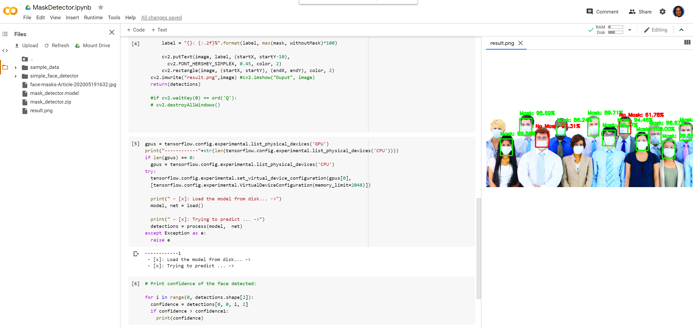

# MultiFace_FaceMaskDetector
Detect mask v/s no-mask on faces in an image using a combination of a openCV based face detector DNN and a trained keras model for mask detection.  Model and Google Colab ipynb included. 

1) Upload mask_detector.zip file to google colab;
2) Upload ipynb to Google Colab or "open in colab" using the Colab Chrome plugin 
   
3) The code outputs a "result.png" file with the detected faces and a green / red mask based on whether a mask is detected. 
   

Trained models for this example come from [Bayangmbe Moumno](https://github.com/bm777/humanface-mask-detector) based on a dataset of simulated masked-face images created using an innovative OpenCV pipeline based on face landmark detection, by [Prajna Bhandary](https://lnkd.in/fJTAP_D). This dataset consists of 1,376 images belonging to two classes:
- with_mask: 690 images
- without_mask: 686 images

Read more about how to train your own model and work the face-landmark based mask simulator on [Adrian Rosebrock's](https://www.pyimagesearch.com/2020/05/04/covid-19-face-mask-detector-with-opencv-keras-tensorflow-and-deep-learning/) blog post.

